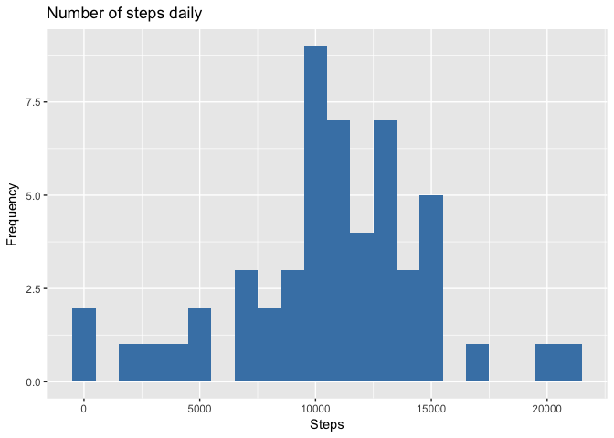
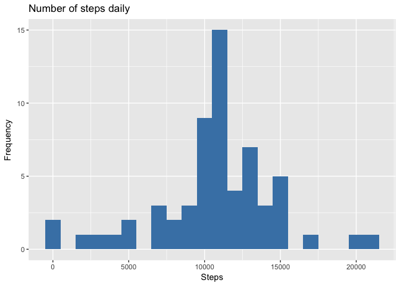

# Reproducible Research: Peer Assessment 1


```r
rm(list = ls())
getwd()
```

```
## [1] "/Users/soni/Desktop/DATA_SCIENCE specialization/Reproducible Research/WEEK 2"
```

```r
library(ggplot2)

#Reading the dataset
mydata<-read.csv("activity.csv",header = TRUE,stringsAsFactors = FALSE)

# change date type to date class
mydata$date<-as.Date(mydata$date)

result_df<-aggregate(steps~date,mydata,sum)

mean(result_df$steps,na.rm = TRUE)
```

```
## [1] 10766.19
```

```r
median(result_df$steps,na.rm = TRUE)
```

```
## [1] 10765
```

```r
# Time series plot og interval and the average steps
#plotting the histogram using ggplot
ggplot(result_df, aes(x = steps)) +
  geom_histogram(fill = "steelblue", binwidth=1000) +
  labs(title = "Number of steps daily", x = "Steps", y = "Frequency")
```

<!-- -->

```r
#Calculation of maxinum steps in a day and ordering them
max_df<-aggregate(steps~interval,mydata,max)
# Calculation of mean of the steps across the interval
max_df<-aggregate(steps~interval,mydata,mean)
max_val<-max_df[order(max_df$steps , decreasing = TRUE, na.last = TRUE), ]
head(max_val,1)
```

```
##     interval    steps
## 104      835 206.1698
```

```r
# storing the value in mean_steps
mean_steps<-max_df$steps
#combining dataset with a new column mean_steps
total_dataset<-cbind(mydata,mean_steps)
#imputation NA by mean
total_dataset$steps[is.na(total_dataset$steps)]<-total_dataset$mean_steps[is.na(total_dataset$steps)]#Imputed dataset

result_df1<-aggregate(steps~date,total_dataset,sum)
#calculation of mean and median afet the imputation 
mean(result_df1$steps,na.rm = TRUE)
```

```
## [1] 10766.19
```

```r
median(result_df1$steps,na.rm = TRUE)
```

```
## [1] 10766.19
```

```r
#calculation of mean and median after the imputation 
sum((is.na(mydata)))# NA in dataset
```

```
## [1] 2304
```

```r
ggplot(result_df1, aes(x = steps)) +
  geom_histogram(fill = "steelblue", binwidth=1000) +
  labs(title = "Number of steps daily", x = "Steps", y = "Frequency")
```

<!-- -->


```r
#conversion of dataset to weekdays
total_dataset$weekday<-weekdays(as.Date(total_dataset$date,'%Y-%m-%d'))

total_dataset$weekend <- ifelse (total_dataset$weekday == "Saturday" | total_dataset$weekday== "Sunday", "Weekend","Weekday")
total_dataset$weekend<-as.factor(total_dataset$weekend)


result_df21<-aggregate(total_dataset$steps,by=list(total_dataset$weekend,total_dataset$interval),mean)
names(result_df21)[1] ="weekend"
names(result_df21)[2] ="interval"
names(result_df21)[3] ="steps"

#plotting the time series graph for comparison  Average steps for weekdays and weekends
ggplot(result_df21, aes(x = interval, y=steps,color=weekend) )+
  geom_line() +facet_grid(weekend ~ .) +labs(title = "Average steps by Interval", x = "interval", y = "steps")
```

<!-- -->
